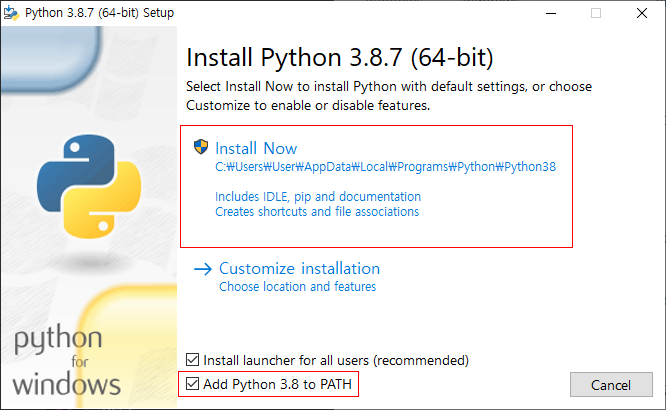
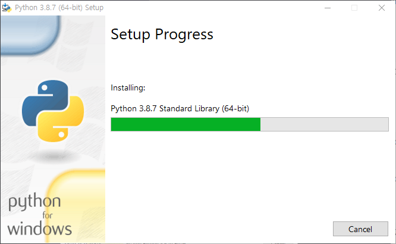
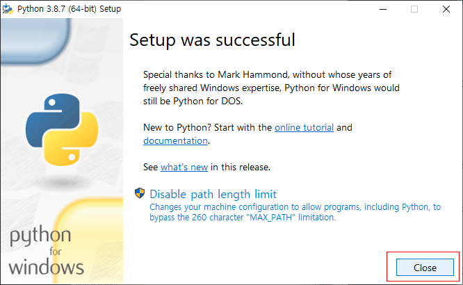
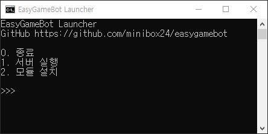

# EasyGameBot

[](https://www.codefactor.io/repository/github/minibox24/easygamebot/overview/master)

**프로그래밍을 몰라도 쉽게 나만의 디스코드 게임봇을.**

이 프로젝트는 프로그래밍을 몰라도 쉽게 설정만 변경하여 나만의 특별한 디스코드 게임 봇을 만들 수 있도록 제작한 프로젝트입니다.

## 빠른 시작
이 프로젝트를 시작하기 위한 방법입니다.

### 파이썬 설치
이 프로젝트를 시작하려면 Python 3.8.7(권장)이 필요합니다.

[파이썬 3.8.7 설치 링크](https://www.python.org/ftp/python/3.8.7/python-3.8.7-amd64.exe)

1. 파이썬 설치 프로그램을 다운 받은 뒤, 프로그램을 실행합니다.

3. 설치 프로그램에서 밑에 있는 `Add Python 3.8 to PATH` 체크박스를 체크합니다.

5. `Install Now` 버튼을 누르고 설치를 시작합니다.



4. 설치를 기다립니다.



5. 설치를 마치면 Close 버튼을 눌러 설치 프로그램을 종료합니다.



### 프로젝트 설치
이 프로젝트를 실행하기 위해서는 프로젝트를 다운로드해야 합니다.

~~최신 릴리즈 다운로드~~ **현재 개발 중 입니다.**

[최신 개발버전 다운로드](https://github.com/minibox24/easygamebot/archive/build.zip)

### 모듈 설치
```shell
python -m pip install -r requirements.txt
```

또는 `launcher.bat`의 2번을 실행하여 모듈을 설치할 수 있습니다.



### 봇 실행
```shell
python run.py
```

또는 `launcher.bat`의 1번을 실행하여 봇을 실행할 수 있습니다.


## 라이선스 
이 프로젝트는 MIT 라이선스를 적용하고 있습니다.

라이선스에 따라서 **절대로** 이 프로젝트에 대한 출처를 삭제해서는 안됩니다.

또한 이 프로젝트의 코드를 사용해 자신의 프로젝트에 사용하는 경우에도 [출처](https://github.com/minibox24/easygamebot) 를 남겨야 합니다.

## 개발
이 프로젝트는 Python과 vue-cli를 사용합니다. 
```shell
# 의존성 설치
python -m venv venv  # 파이썬 가상 설치 (필수가 아닙니다.)
venv/bin/python -m pip install -r requirements.txt
cd webdev
npm install

# 웹 테스트
npm run serve

# 웹 빌드
npm run build

# 서버 실행
venv/bin/python run.py 
```

## 기여
이 프로젝트는 black 코드 포맷터를 사용합니다.

기여하실 때 black을 사용하여 코드를 고친 후, Pull Request를 해주세요.

## 크레딧
Minibox: 메인 개발

Serial_number: 주식 알고리즘
